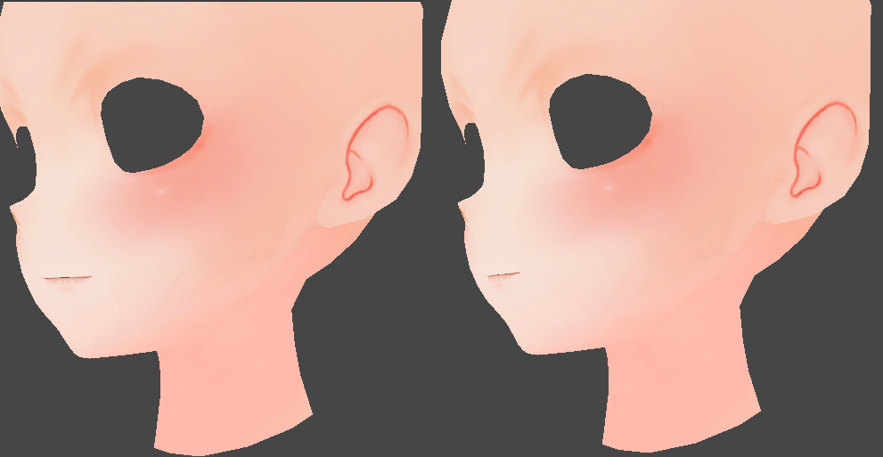

# 卡通渲染面部形变

***
起因是看到MuRo_CG分享的

他应该是用blendShape做的，想尝试顶点变换是否可行。

    <!-- 左边的图+文 -->
    

        
        
理想目标

    

    <!-- 右边的图+文 -->
    

        
        
现实

    

一个严重的问题是，俯仰视角下的嘴部回正非常突兀（原作者埋坑，他不展示是有原因的），引起的原因是我的方案最初使用视角钳制有效范围生成由正脸到侧脸的权重（0-1-0）过程。这也带上了俯仰方位的变化，在临界值附近尤为明显。

## 方案

修改的地方在于排除掉了View向量的Y轴影响。取的是View在XZ上的投影长度作垂直权重，使用View计算的横向弧度计算描述一个0°->45°->90°的横向变化权重(背面看不见，不影响结果或者使用完整的2PI区间)。

angle = H * V * θ

最后让遮罩范围内的顶点绕目标轴旋(口内)转即可

{:width="20%"}

**最后是对比效果**

    <!-- 左边的图+文 -->
    

        
        
原始

    

    <!-- 右边的图+文 -->
    

        
        
修改

    

## 可能的问题

因为没有修改顶点法线，光照？

口腔内牙齿、舌头可能穿模？

***

[back](../../coding-page.html)