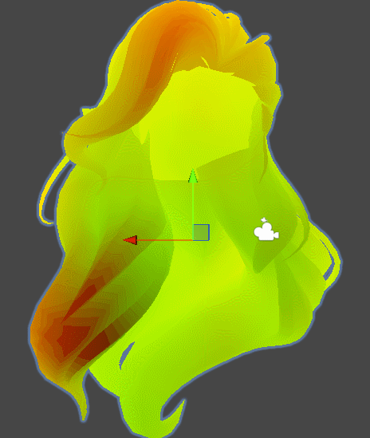
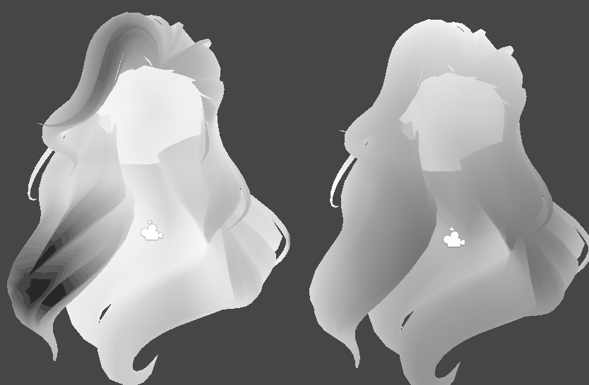

# 头发体积密度测试

***

|图1|图2|

在Unity Enemies中提到了对头发进行体素密度预计算，其目的是更好的实现多重散射时的头发密度估计。

*这里仅作测试，与原版有出入*

烘焙思路：取体素中心点到相邻三角形最小距离平方，根据距离计算密度（0密度最大，理解成体素格子内的填充率，越接近体素中心填充越多）。

采样思路：使用light、view两个方向对3d密度图步进采样，每次步进一个体素取样当前和上一个密度信息进行比较并累计。

## 图1：
可以简单的理解为一个“厚度表现”，只不过这个厚度因为体素累计的缘故，在不同角度呈现不同结果（注意观察额发部分的红色）。

## 图2：
R通道用于前向散射，呈现逆光，光线穿透发丝和发丝间的缝隙，经过散射后朝向观察者传播。边缘柔软轮廓光的描述。这里一般使用全局光照部分。
G通道用于后向散射，光源与眼睛同侧时，照射半透明头发的光线散射回入射点附近。

照亮阴影范围全局散射中忽略后向散射，局部散射中保留。

***

[back](../../coding-page.html)