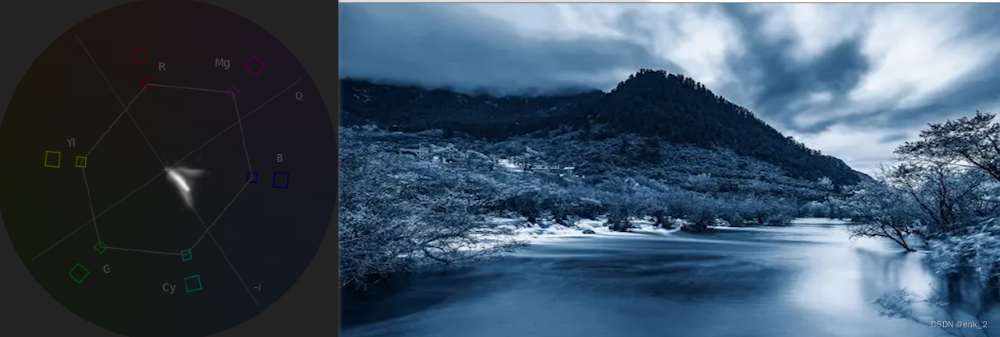
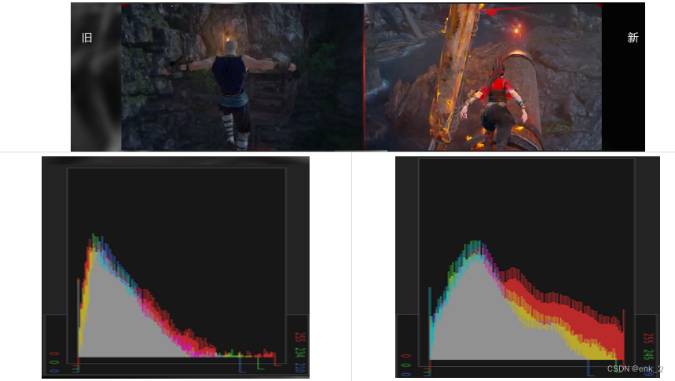
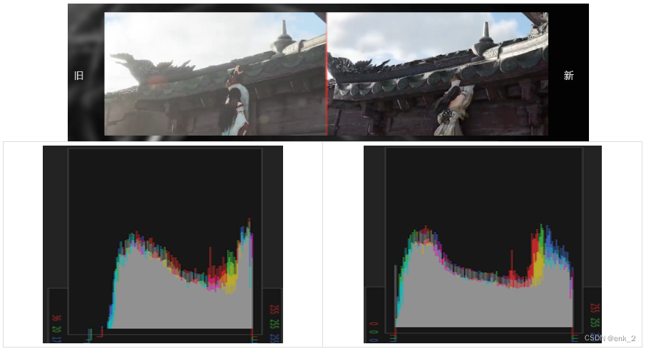
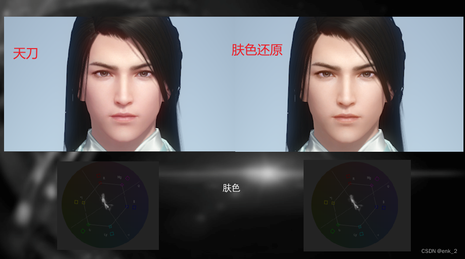
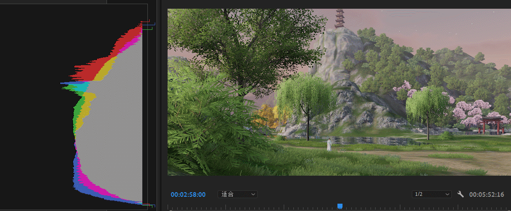
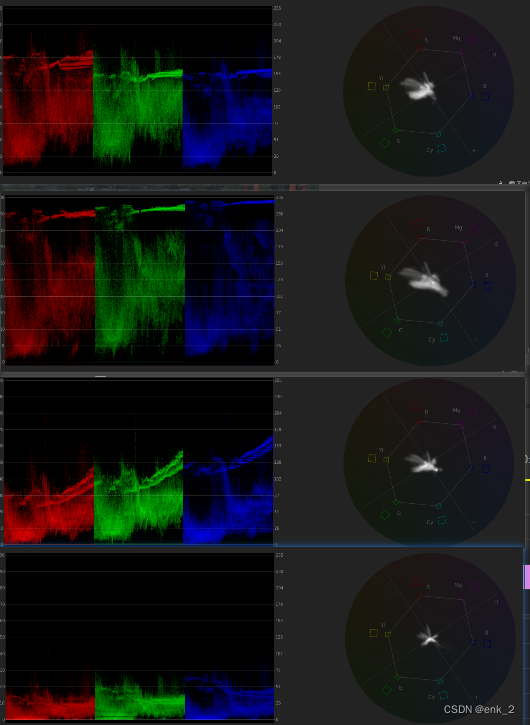
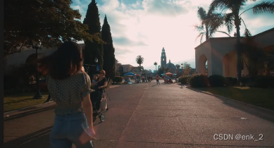
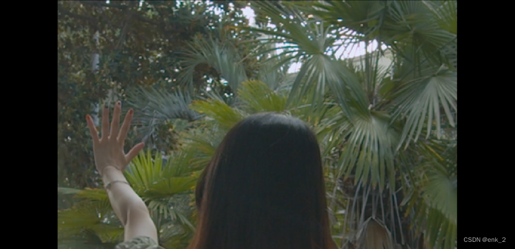
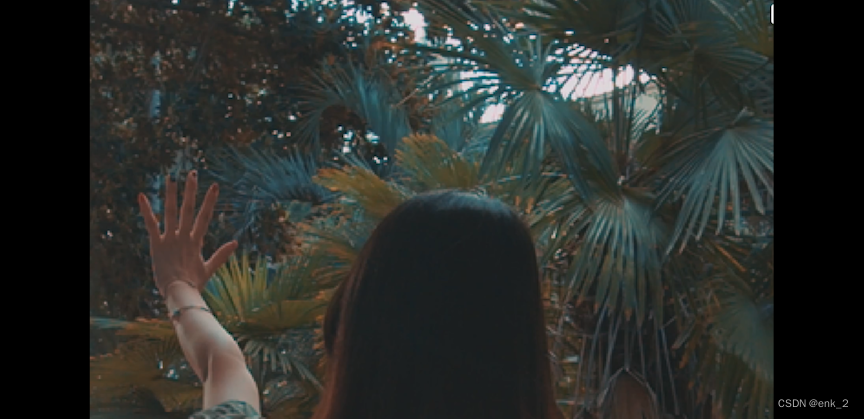
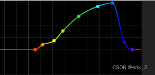

**示波器可做什么？**

基础材质检查环境搭建校验

相似材质之间的细微差异分析

场景调光依据/竞品分析

定位曝光、色相问题

风格化调色监视

LUTs检查

## 材质检查

单看上图的分量示波器，仔细想一想这张图是什么色相？

公布答案

分量示波器rgb模式三通道所表述的就是画面从左到右，不同明度rgb占比分布，我们看到r通道总体偏弱，g通道次之，所以画面呈现蓝色。

## 竞品分析

《永劫无间》

 永结无间的画质提升展示，提升了什么？从直方图上看，修改曝光范围，找回了黑白场，画面不那么黑那么灰了。

## 定位曝光变化

《天涯明月刀手游》自动曝光

波形示波器容易直观感受画面亮度变化

## 竞品分析

矢量示波器适合观察画面的色相

除了调光阶段可以使用示波器进行辅助调整以外，我们还可以使用示波器分析竞品画面。

从直方图中我们可以看到，早午晚夜各个时段的曝光情况

除正午天空和场景有大光影反差外，整体暗部信息过度平缓，中间调居多。凌晨低短调，中间调少，暗部信息堆积画面细节少

早晨偏暖，中午趋于平衡 ，晚上偏冷，午夜偏冷。

除午夜外，其他时段暗部细节良好没有截断。

亮度分布可以清晰看到其规律。

色相上大体是黄蓝互补，植被亮部除午夜都向黄色靠拢发暖，暗部早晨偏青其他时段为蓝。

## LUTs检查

当我们看到一个比较好看的LUTs预制

目标LUTs中树叶都变成了黄昏的相似色

而我们的画面中树叶变成了青色

在PS也好其他软件也罢，对我们的LUTtexture进行颜色反矫正

示例Pr：对色相与色相调整）

左1目标范例，中间套用后，右侧校准后

（当然这不是通用调整，需要根据每个关卡的反应来取中间值，亦或逆推LUTs甚至弃用该模板）

我们将青色部分肉眼还原到理想区域

色相与色相？是不是有点眼熟？

是的，unity后处理配置中是内置曲线工具的，他的子调整选择中就有色相与色相。

更多的后处理调整，那就是后处理校色课程的内容了。

量化画面信息并展示结果，这就是“示波器”

[back](../../coding-page.html)