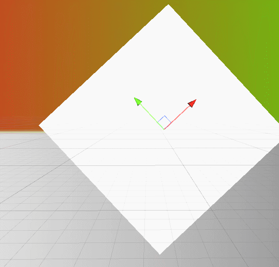

这只是对四边形UI的简单抗锯齿实验
思路是通过override Image里的OnPopulateMesh函数修改UI顶点，由4个改为5个（中心点）
在中心点和环绕点绘制不同的顶点颜色，最后做边缘半透过度来缓解锯齿
[参考](https://qiita.com/kumaS-kumachan/items/29548bc10d98472eecf4#%E3%81%AF%E3%81%98%E3%82%81%E3%81%AB)
## C#

```cpp
using UnityEngine;
using UnityEngine.UI;
[RequireComponent(typeof(CanvasRenderer))]
[RequireComponent(typeof(RectTransform))]
public class TestUIImage : Image
{

    protected override void OnPopulateMesh(VertexHelper vh)
    {
        vh.Clear();
        // 2*---------*3
        //  |         |
        //  |   0*    |
        //  |         |
        // 1*---------*4
        //从中点开始绘制四边形，为顶点色填入内外信息，用于shader计算sdf
        
        UIVertex v0 = UIVertex.simpleVert;
        v0.position = CreatePos(0.5f, 0.5f);
        v0.color = Color.white;
        v0.uv0 = new Vector2(0.5f,0.5f);
        vh.AddVert(v0);
        
        UIVertex v1 = UIVertex.simpleVert;
        v1.position = CreatePos(0, 0);
        v1.color = Color.black;
        v1.uv0 = new Vector2(0,0);
        vh.AddVert(v1);
        
        UIVertex v2 = UIVertex.simpleVert;
        v2.position = CreatePos(0, 1);
        v2.color = Color.black;
        v2.uv0 = new Vector2(0,1);
        vh.AddVert(v2);
        
        UIVertex v3 = UIVertex.simpleVert;
        v3.position = CreatePos(1, 1);
        v3.color = Color.black;
        v3.uv0 = new Vector2(1,1);
        vh.AddVert(v3);
        
        UIVertex v4 = UIVertex.simpleVert;
        v4.position = CreatePos(1, 0);
        v4.color = Color.black;
        v4.uv0 = new Vector2(1,0);
        vh.AddVert(v4);


        vh.AddTriangle(0,1,2);
        vh.AddTriangle(0,2,3);
        vh.AddTriangle(0,3,4);
        vh.AddTriangle(0,4,1);
        //vh.AddUIVertexQuad(new UIVertex[]{v1, v2, v3, v4, v5});
    }
    
    private Vector2 CreatePos(float x, float y)
    {
        Vector2 p = Vector2.zero;
        p.x -= rectTransform.pivot.x;
        p.y -= rectTransform.pivot.y;
        p.x += x;
        p.y += y;
        p.x *= rectTransform.rect.width;
        p.y *= rectTransform.rect.height;
        return p;
    }
}

```
## Shader
[参考](https://blog.csdn.net/yinhun2012/article/details/121480391)
```csharp
Shader "Custom/UI/UIAA"
{
    Properties
    {
        [PerRendererData]_MainTex ("Texture", 2D) = "white" {}
        [Toggle]_IsAA("UI AA", float) = 0
        _Width("Edge Width", range(0.01,1)) = 0.01
        [HideInInspector]_StencilComp ("Stencil Comparison", Float) = 8
        [HideInInspector]_Stencil ("Stencil ID", Float) = 0
        [HideInInspector]_StencilOp ("Stencil Operation", Float) = 0
        [HideInInspector]_StencilWriteMask ("Stencil Write Mask", Float) = 255
        [HideInInspector]_StencilReadMask ("Stencil Read Mask", Float) = 255
        [HideInInspector]_ColorMask ("Color Mask", Float) = 15
    }
    SubShader
    {
        Tags {
            "Queue"="Transparent"
            "IgnoreProjector"="True"
            "RenderType"="Transparent"
            "PreviewType"="Plane"
            "CanUseSpriteAtlas"="True"
            }
        Stencil
        {
            Ref [_Stencil]
            Comp [_StencilComp]
            Pass [_StencilOp]
            ReadMask [_StencilReadMask]
            WriteMask [_StencilWriteMask]
        }
        
        Lighting Off
		ZWrite Off
		ZTest [unity_GUIZTestMode]
        Blend SrcAlpha OneMinusSrcAlpha
        ColorMask [_ColorMask]

        Pass
        {
            HLSLPROGRAM
            #pragma vertex vert
            #pragma fragment frag

           #include "Packages/com.unity.render-pipelines.universal/ShaderLibrary/Core.hlsl"

            struct appdata
            {
                float4 vertex : POSITION;
                float2 uv : TEXCOORD0;
                half4 color : COLOR;
            };

            struct v2f
            {
                float2 uv : TEXCOORD0;
                float4 vertex : SV_POSITION;
                half4 color : COLOR;
            };

            TEXTURE2D(_MainTex);SAMPLER(sampler_MainTex);
            CBUFFER_START(UnityPerMaterial)
            float4 _MainTex_ST;
            half _Width;
            half _IsAA;
            CBUFFER_END

            v2f vert (appdata v)
            {
                v2f o;
                o.vertex = TransformObjectToHClip(v.vertex);
                o.uv = TRANSFORM_TEX(v.uv, _MainTex);
                o.color = v.color;
                return o;
            }

            half4 frag (v2f i) : SV_Target
            {
                // sample the texture
                half4 col = SAMPLE_TEXTURE2D(_MainTex, sampler_MainTex, i.uv);
                
                UNITY_BRANCH if (_IsAA)
                {
                    float edge = i.color.r;
                    //根据边缘黑色作为阈值进行alpha插值即可
                    if(edge<_Width)
                    {
                        col.a *= lerp(0, 1, edge / _Width);;
                    }
                }
                
                return col;
            }
            ENDHLSL
        }
    }
}

```

[back](../../coding-page.html)