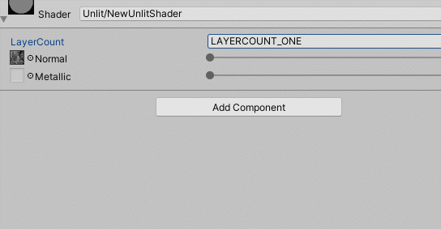
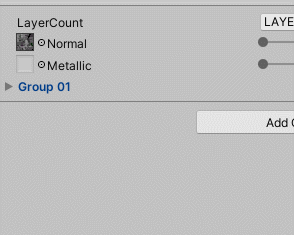
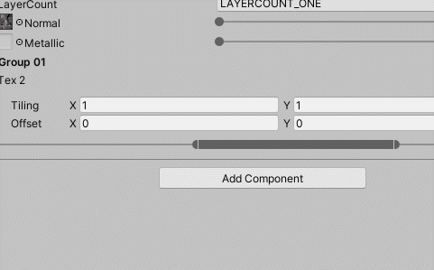
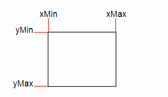
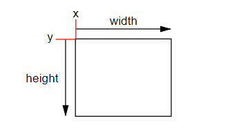

<font color=blue>前言：</font>
<font color=blue>本文适合为material界面简单定制时使用。</font>

# Shader GUI

Unity shader中可以引入自定义UI界面，提高阅读shader属性的便利程度。

CustomEditor “namespace.name” 

ShaderGUI通过shader中的CustonEditor关联UI脚本，Unity会调用OnGUI来绘制面板， UI脚本必须放入Editor文件夹中.
```c#
public class TestGUI : ShaderGUI
{
	//OnGUI接收两个参数：
    MaterialEditor materialEditor;//当前材质面板
    MaterialProperty[] properties;//当前shader的properties

    Material targetMat;//绘制对象材质球
    string[] keyWords;//当前shader keywords
    
    Public override void OnGUI(MaterialEditor materialEditor, MaterialProperty[] properties)
    {
        this.MaterialEditor = materialEditor;
        this.MaterialProperty = properties;
        this.targetMat = materialEditor.target as Material;
        this.keyWords = targetMat.shaderKeywords;
        //关键字是否存在可以判断分支的开启状态
        show();
    }
    
    void show(){
        GUILayout.Label(“Hello Word”);
    }

}
```


*我们开启自定义UI显示以后，默认UI将会失效。*  
<br><br><br>
## 贴图单行显示

FindProperty会根据属性名称ID去查找materialProperties中包含的相应属性，Content是一个显示Lable,它包含了属性名称，属性数值和属性Tips。最后用materialEditor绘制单行贴图UI

```c#
//显示贴图
MaterialProperty _CubeMap= FindProperty(“_CubeMap”, materialProperties, true);
GUIContent content = new GUIContent(_CubeMap.displayName, _CubeMap.textureValue, “cube Map”);//tips 是说明文字，鼠标悬停属性名称时显示
materialEditor.TexturePropertySingleLine(content, _CubeMap);
```


添加调色给这张图,在原有属性下方查找到颜色，GUI容器还是使用cubemap的,这时color就会出现在cubemap之后单行显示。

```c#
MaterialProperty tint = FindProperty(“_Color”, materialProperties, true);
//modification
materialEditor.TexturePropertySingleLine(content, _CubeMap, tint);//重载方法
//添加缩放偏移属性显示
//EditorGUI.indentLevel是将绘制的元素进行头部位置偏移
EditorGUI.indentLevel++;
//添加贴图缩放
materialEditor.TextureScaleOffsetProperty(_CubeMap);
EditorGUI.indentLevel--;
//偏移后须将头部位置归位，即便在属性列表末端也需要。
```

## 法线单行显示，无贴图隐藏滑竿

```c#
MaterialProperty _Normal = FindProperty(“Normal”, materialProperties,true);
MaterialProperty _NormalStrength= null;
//如果有贴图让容器包括强度绘制，没贴图不绘制强度
If(_Normal.textureValue != null)
{
	_NormalStrength = FindProperty(“_NormalStrength”, materialproperties, true);
}

materialEditor.TexturePropertySingleLine(MakeGUIContent(_Normal), _Normal, _NormalStrength );

//自定义绘制content方法
GUIContent MakeGUICOntent(MaterialProperty m){
	GUIContent content = new GUIContent(m.displayName, m.textureValue, “”);
Return content;
}

```


## 贴图特殊设置提示

在默认attribute中我们使用法线贴图时会提示我们当前传入图片是否是法线，我们可以借鉴这一功能定义我们自己需要设置的内容作为提示显示出来。

```c#
MaterialProperty _Tex2 = FindProperty("_Tex2", properties);
materialEditor.TextureProperty(_Tex2, "Tex 2");

if (_Tex2 != null && _Tex2.textureValue.wrapMode != TextureWrapMode.Clamp)
{
	setClamp = materialEditor.HelpBoxWithButton(new GUIContent("贴图需要clamp模式"), new GUIContent("设置")); //setClamp : bool
}
```
```C#
//当我们修改状态以后可以对离线资源进行同步设置
if(setClamp){
    setClamp = false;
    string path = AssetDatabase.GetAssetPath(_Tex2.textureValue);
    TextureImporter textureImporter = AssetImporter.GetAtPath(path) as TextureImporter;
    textureImporter.warpMode = TexturWrapMode.Clamp;
    textureImporter.SaveAndReimport();
}
```


贴图其他涉及到非TextureImport的则不适用

## UI界面变更检查

现在是在OnGUI中每帧重复执行所有方法(<font color=red>并不是每帧重绘制</font>)，我们应当是material属性改变以后在执行内部方法赋值shader。

```c#
 void SetKeyWord(string keyword, bool enable)
    {
        if(enable){
            targetMat.EnableKeyword(keyword);
        }
        else
        {
            targetMat.DisableKeyword(keyword);

        }
    }

EditorGUI.BeginChangeCheck();//需要检查的位置之前放置
materialEditor.TexturePropertySingleLine(MakeGUIContent(_Metallic), _Metallic, _Metal);
If(EditorGUI.EndChangeCheck())//有修改返回ture
{
	SetKeyWord(_Metallic.name.ToUpper() + "_ON", _Metallic.textureValue != null);
}

```


```C#
//也可以根据debug来查看keyword是否成功
targetMat.IsKeywordEnabled(string)
```
## 根据条件隐藏显示所属UI控件


```c#
//设置列表显示关键字
public enum LAYER_COUNT
{
    _LAYERCOUNT_ONE, _LAYERCOUNT_TWO, _LAYERCOUNT_THREE
}

public LAYER_COUNT LC;
public void SetKeyWorld(LAYER_COUNT settings)
    {
           switch (settings)
        {
            case LAYER_COUNT._LAYERCOUNT_ONE:
                targetMat.DisableKeyword(LAYER_COUNT._LAYERCOUNT_THREE.ToString());
                targetMat.DisableKeyword(LAYER_COUNT._LAYERCOUNT_TWO.ToString());
                targetMat.EnableKeyword(LAYER_COUNT._LAYERCOUNT_ONE.ToString());
                break;
            case LAYER_COUNT._LAYERCOUNT_TWO:
                targetMat.DisableKeyword(LAYER_COUNT._LAYERCOUNT_ONE.ToString());
                targetMat.DisableKeyword(LAYER_COUNT._LAYERCOUNT_THREE.ToString());
                targetMat.EnableKeyword(LAYER_COUNT._LAYERCOUNT_TWO.ToString());
                break;
            case LAYER_COUNT._LAYERCOUNT_THREE:
                targetMat.DisableKeyword(LAYER_COUNT._LAYERCOUNT_ONE.ToString());
                targetMat.DisableKeyword(LAYER_COUNT._LAYERCOUNT_TWO.ToString());
                targetMat.EnableKeyword(LAYER_COUNT._LAYERCOUNT_THREE.ToString());
                break;
        }

    }

```

我们将enum控件绘制在最顶端，根据修改去赋值shader

```
EditorGUI.BeginChangeCheck();
LC = (LAYER_COUNT)EditorGUILayout.EnumPopup("LayerCount", LC);
if (EditorGUI.EndChangeCheck()) { 
        SetKeyWorld(LC);	
}
```


因为我们设置了分支关键字，shader内会根据关键字走相应流程。我们可以将不被使用的流程属性隐藏。



## 折叠组

和上一步的实现类似区别在于使用一个带有折叠判断的控件绘制,可以使用FoldoutHeaderGroup或Foldut

```C#
isFoldut = EditorGUILayout.BeginFoldoutHeaderGroup(isFoldut, "Group 01");
if (isFoldut)
{
    //TODO
}
EditorGUILayout.EndFoldoutHeaderGroup();
```


## 可调节min max的滑动条

节省控件位置或者更直观的表达时使用，中间以0为例，左区间是[minLimit,0]右[0,maxLimit]

左右区间是可以被动态修改的

```c#
EditorGUILayout.MinMaxSlider(ref minVal, ref maxVal, minLimit, maxLimit);
```


## 控件容器 Rect

在界面中每一个控件都可以定制长宽。x，y  0点在左上角





如果我们手动设置rect，那样以后排板将会很痛苦。

```c#
//获取上一个Rect
//Rect eST = GUILayoutUtility.GetLastRect();
Rect e;

if(Event.current.type == EventType.Repaint){
    e = GUILayoutUtility.GetLastRect();
}
```

判断执行事件是为了避免获取失效。

我们用一个silder来控制一个box的长短，使其100%时填充满inspector宽。

```c#
slider =  EditorGUILayout.Slider(slider, 0, 1);
GUI.backgroundColor =  Color.green;
GUILayout.Box(new GUIContent(), GUILayout.Width(slider*e.width));
```


最后是可用控件doc

https://docs.unity3d.com/cn/2019.4/ScriptReference/EditorGUI.html


[back](../coding-page.html)